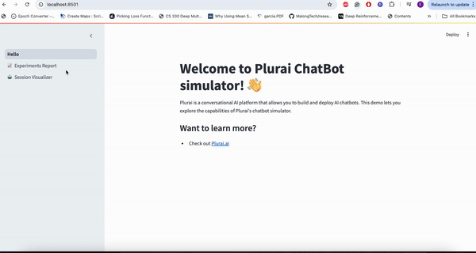

# CHat-Agent-Simulator (CHAS) 

<p align="center">
    <!-- community badges -->
    <a href="https://discord.gg/G2rSbAf8uP"></a>
    <!-- license badge -->
    <a href="https://github.com/plurai-ai/Chat-Agent-Simulator/blob/main/LICENSE">
        </a>
</p>

<!-- MARKDOWN LINKS & IMAGES -->
<!-- https://www.markdownguide.org/basic-syntax/#reference-style-links -->


**CHat-Agent-Simulator (CHAS)** is an AI-powered diagnostic framework driven by Large Language Models (LLMs) and AI agents. It simulates thousands of edge-case scenarios to comprehensively evaluate chatbot agents. By stress-testing your agent from all angles in wide-range of complexity levels, CHAS helps identify potential failure points and provides detailed performance analysis to ensure reliable deployment.

**Our mission:** To revolutionize chatbot development by providing comprehensive testing that enables developers to deploy with confidence.

# Why CHAS?

Companies today face a critical challenge when deploying chatbot agents: balancing capability with reliability. Most organizations end up severely limiting their chatbots' capabilities (restricting them to read-only operations or minimal tool access) due to concerns about:

- Policy violations
- Inconsistent responses
- Unexpected edge cases

This is where CHAS transforms the landscape. Instead of restricting your agent's capabilities due to uncertainty, CHAS empowers you to:

1. **Discover the Unknown**: Generate thousands of edge-case scenarios that stress-test your agent from every angle
2. **Identify Failure Points**: Proactively detect and understand where your agent might fail
3. **Optimize Capabilities**: Find the optimal balance between functionality and reliability
4. **Deploy with Confidence**: Release chat agents that are both powerful AND reliable

CHAS turns the traditional "restrict-by-default" approach into a data-driven "enable-with-confidence" strategy. By thoroughly simulating and analyzing your agent's behavior, you can expand its capabilities while maintaining strict reliability standards.

Don't limit your chatbot's potential because of what you don't know. Use CHAS to know exactly what your agent can handle, fix what it can't, and deploy with confidence.

## 🚀 How CHAS AI Pipeline Works

CHAS operates through an AI pipeline of components powered by LLMs and AI Agents that work together to test and evaluate chatbot agents. The pipeline is outlined below:

| **Step** | **Description** | **Illustration** |
|----------|-----------------|------------------|
| 1. **Input Context** | Analyze the agent's context, including task description, tools, and database schema. |  |
| 2. **Flow and Policies Generation** | Decompose the agent's task into sub-flows and extract relevant policies. |  |
| 3. **Policies Graph Generation** | Create a weighted graph representing relationships between policies to identify complex scenarios. |  |
| 4. **Generate Dataset Event** | Create a dataset of scenario events with varying challenge scores for thorough testing. |  |
| 5. **Run Simulation Events** | Execute simulation events through an interactive dialog system, capturing performance insights. |  |
| 6. **Report (Comprehensive Evaluation)** | Generate a detailed evaluation report analyzing performance and failure points. |  |

For more details, refer to the [How it works](docs/how-it-works.md) (Explanation of AI Pipeline).

## 🔍 Demo



## 📖 Documentation

- [Installation & Quick Start](./docs/installation.md)  
  Step-by-step setup instructions.

- [How It Works](./docs/how-it-works.md)  
  Detailed explanation of the AI pipeline.

- [Architecture Guide](./docs/architecture.md)  
  Overview of the system's main components.

- [Running Examples](./docs/examples.md)  
  Running examples from various agents, including [airline agent](./docs/examples/airline.md), including [retail agent](./docs/examples/retail.md),[langgraph agent](./docs/examples/langraph.md) 
 
## Features

- 🔬 Simulates thousands of edge-case events tailored to your chatbot agent
- 🤖 Simulates user interactions with your agent based on generated events
- 📊 Comprehensive report with evaluation metrics including success rates, policy & tools failure points, complexity-level analysis
- 🚀 Enables confident deployment of more reliable chatbot agents

## :fire: QuickStart
Chat-Agent-Simulator (CHAS) requires `python == 3.10`
<br />

> **Step 1** - Download the project

```bash
git clone git@github.com:plurai-ai/Chat-Agent-Simulator.git
cd Chat-Agent-Simulator
```

<br />

> **Step 2** - Install dependencies

Use either Conda, pip, or pipenv, depending on your preference.

Using Conda:
```bash
conda env create -f environment_dev.yml
conda activate Chat-Agent-Simulator
```

Using pip: 
```bash
pip install -r requirements.txt
```

Using pipenv:
```bash
pip install pipenv
pipenv install
```

<br />

> **Step 3** - Configure your LLM API Key

Edit the `config/llm_env.yml` file to set up your LLM configuration:

```yaml
openai:
  OPENAI_API_KEY: "your-api-key-here"
  OPENAI_API_BASE: ''
  OPENAI_ORGANIZATION: ''

azure:
  AZURE_OPENAI_API_KEY: "your-api-key-here"
  AZURE_OPENAI_ENDPOINT: "your-endpoint"
  OPENAI_API_VERSION: "your-api-version"

```

<br />

> **Step 4** - Configure the simulator run parameters

Before running the simulator, you need to configure the `config_default.yml` file located in the `config` folder. This file contains important settings for the simulator. Here's an overview of the main sections and their purposes:

- `environment`: Specifies paths for the prompt, tools, and data-scheme folders, as well as the task description. For example:
  ```yaml
  environment:
      prompt_path: 'examples/airline/wiki.md'
      tools_folder: 'examples/airline/tools/agent_tools.py'
      database_folder: 'examples/airline/data_scheme'
  ```

- `description_generator`: Contains settings for various components of the description generation process, including flow extraction, policies extraction, edge configuration, and description refinement.

- `event_generator`: Configures the event generation process, including the LLM to use and worker settings.

- `dialog_manager`: Sets up the simulator dialog management system, including user parsing mode, memory path, and LLM configurations for user simulation and chat.

- `dataset`: Defines parameters for dataset generation, such as difficulty levels, number of samples, and cost limits in $.

Key points to configure:

1. **Update file paths** in the `environment` section to match your project structure:
   ```yaml
   prompt_path: 'examples/airline/wiki.md'  # Path to your agent's wiki/documentation
   tools_folder: 'examples/airline/tools'   # Path to your agent's tools
   database_folder: 'examples/airline/data' # Path to your data schema
   ```

2. **Adjust LLM configurations** throughout the file:
   ```yaml
   llm:
       type: 'openai'  # or 'azure'
       name: 'gpt-4o'   # or other model names as gpt-4o-mini
   ```

3. **Configure worker settings** based on your system's capabilities:
   ```yaml
   num_workers: 3    # Number of parallel workers
   timeout: 10       # Timeout in seconds
   ```

4. **Set appropriate cost limits** to control API usage:
   ```yaml
   cost_limit: 30    # In dollars, for simulator dialog manager
   ```

For a complete example configuration, check the `config/config_default.yml` file in the repository.

<br />

> **Step 5** - Run the Simulator

## Running the Simulation Script

The `run.py` script is designed to execute a simulation using a specified configuration and dataset. Follow the steps below to run the script:

### Usage

To run the script, use the following command:
```bash
python run.py --output_path <output_path> [--config_path <config_path>] [--dataset <dataset>]
```

### Arguments

- `--output_path`: (Required) Specify the path where the output file will be saved.
- `--config_path`: (Optional) Specify the path to the configuration file. Defaults to `config/config_default.yml`.
- `--dataset`: (Optional) Specify the dataset name. If set to `'latest'`, the latest dataset will be loaded. Defaults to `'latest'`.

### Example

```bash
python run.py --output_path ./examples/airline/output/run_1 --config_path ./config/config_airline.yml 
```

This command will run the simulation using the specified configuration and dataset, and save the results to `../output/exp1`.

<br />

> **Step 6** - Analyze Simulator Results

After the simulation completes, you can find the results in the specified output path directory with the following structure:

```
experiments/
├── dataset__[timestamp]__exp_[n]/    # Experiment run folder
│   ├── experiment.log                # Detailed experiment execution logs
│   ├── config.yaml                   # Configuration used for this run
│   ├── prompt.txt                    # Prompt template used
│   ├── memory.db                     # Dialog memory database
│   └── results.csv                   # Evaluation results and metrics
│
datasets/
├── dataset__[timestamp].pickle       # Generated dataset snapshot
└── dataset.log                       # Dataset generation logs
│
policies_graph/
├── graph.log                         # Policy graph generation logs
└── descriptions_generator.pickle     # Generated descriptions and policies
```

Each experiment run creates a timestamped folder containing all relevant files for analysis and reproduction. The results.csv file contains the comprehensive evaluation metrics discussed in Step #6 of the System Overview.

To visualize the simulation results using streamlit, run:
```bash 
streamlit run simulator/visualization/Simulator_Visualizer.py
```
This will launch a Streamlit dashboard showing detailed analytics and visualizations of your simulation results.


## 🚀 Community & Contributing

Your contributions are greatly appreciated! If you're eager to contribute, kindly refer to our [Contributing Guidelines](docs/contributing.md)) for detailed information.

If you wish to be a part of our journey, we invite you to connect with us through our [Discord Community](TODO). We're excited to have you onboard! 

## 🛡 Disclaimer

The Chat-Agent-Simulator (CHAS) project is provided on an "as-is" basis without any guarantees or warranties, either expressed or implied. By using this software, you acknowledge that:

- The developers and contributors are not responsible for any damages or losses that may arise from the use or inability to use the software.
- The software is intended for testing and evaluation purposes only and should not be used in production environments without thorough testing and validation.
- The accuracy, reliability, and performance of the software are not guaranteed, and users should exercise caution and perform their own assessments before relying on the software for critical applications.
- Any modifications or customizations made to the software are the sole responsibility of the user, and the developers are not liable for any issues that may result from such changes.

By downloading or using the Chat-Agent-Simulator, you agree to these terms and conditions. If you do not agree, please refrain from using the software.
## Citation

TODO

## License

This framework is licensed under the [Apache License, Version 2.0](http://www.apache.org/licenses/LICENSE-2.0).

Under this license, you are free to use, modify, and distribute the software, provided that you include a copy of the license and any notices in any copies or substantial portions of the software. 

The software is provided "as is", without warranty of any kind, express or implied, including but not limited to the warranties of merchantability, fitness for a particular purpose, and noninfringement. See the [Apache License, Version 2.0](http://www.apache.org/licenses/LICENSE-2.0) for the full text and more details.

## 🔍 Open Analytics

We collect basic usage metrics to better understand our users' needs and improve our services. As a transparent startup, we are committed to open-sourcing all the data we collect. **Plurai does not track any information that can identify you or your company.** You can review the specific metrics we track in the [code](./simulator/healthcare_analytics.py).

If you prefer not to have your usage tracked, you can disable this feature by setting the `PLURAI_DO_NOT_TRACK` flag to true.

## ✉️ Support / Contact us
- Join our Community for discussions, updates and announcements [Community Discord](TODO)
- Our email: [‫chas@plurai.ai‬](mailto:chas@plurai.ai)
- [GitHub Issues](https://github.com/plurai-ai/Chat-Agent-Simulator/issues) for bug reports and feature requests


